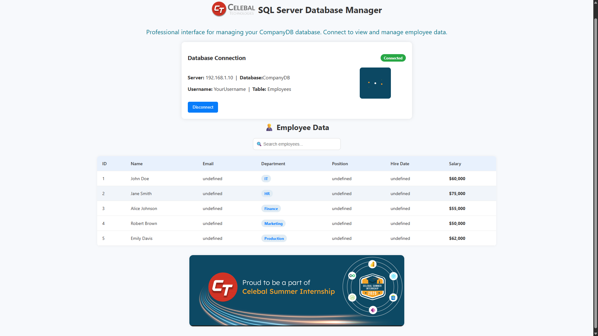
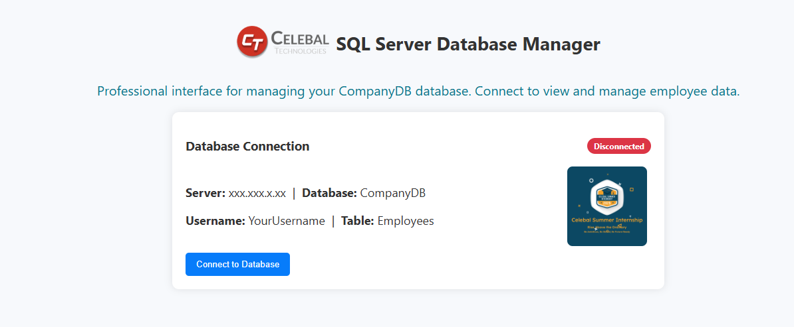

## 
# SQL Server Dashboard (Python + Flask)

This project is a full-stack web dashboard that connects to a remote SQL Server database and displays employee data in a clean, styled frontend interface.
## 
## 🚀 Features
- Connects to a remote SQL Server database using `pyodbc`
- Retrieves and displays top 5 employee rows
- Built using Python (Flask) and vanilla HTML/CSS/JS
- Styled like a modern database management dashboard

## 🛠️ Tech Stack
- Python
- Flask
- pyodbc
- HTML/CSS/JavaScript

## 🔐 Setup (Secure Configuration using `.env`)

Create a `.env` file in the root folder:

```
DB_SERVER=xxx.xxx.xxx.xxx
DB_NAME=CompanyDB
DB_USERNAME=YourUsername
DB_PASSWORD=YourPassword123
```

## 📦 Installation
## Installation

### 1. Clone the Repository
```bash
git clone https://github.com/Marvel-Spiderman/Celebal-internship--project.git
```

### 3. Install Required Packages
```bash
pip install -r requirements.txt
```


Visit: [http://localhost:5000](http://localhost:5000)




## 📁 Folder Structure

sql_dashboard/
├── app.py
├── db_config.py
├── templates/
│   └── index.html
├── static/
│   └── style.css
├── .env
├── requirements.txt
└── CompanyDB.sql            #sampledata
└── README.md


## ⚠️ Warning
Never commit real credentials to GitHub. Use `.env` and add it to `.gitignore`.+

---
  ## 
🙏 Thank You Note
Big thanks to **Celebal Technologies** for the incredible internship experience! 🙌
As a **Data Engineer Intern**, I learned the basics of Python, SQL, and data engineering.
This project is a culmination of my learning experience and I'm grateful for the opportunity to contribute in the techsociety.
My project — SQL Server Dashboard (Python + Flask) — helped me build real-world skills and was a great learning journey. 💻📊
Grateful for the support and opportunity — excited to apply what I’ve learned! 🚀

Made with ❤️ by **Rounit Raj**
